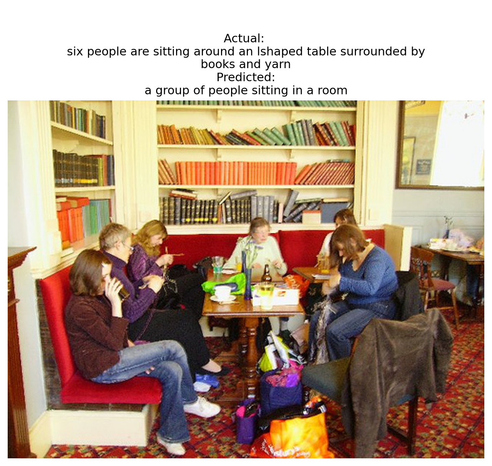
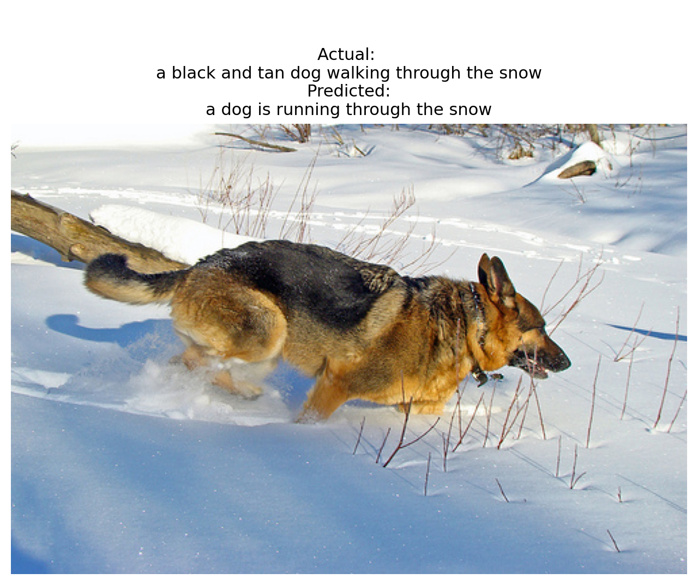
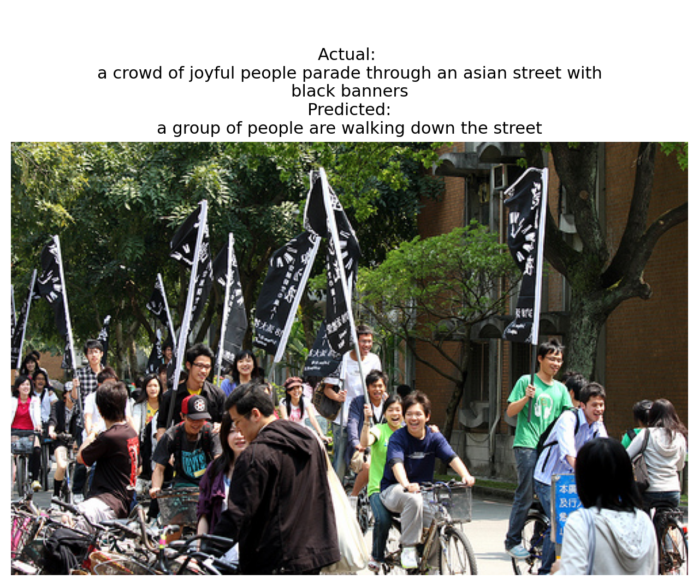
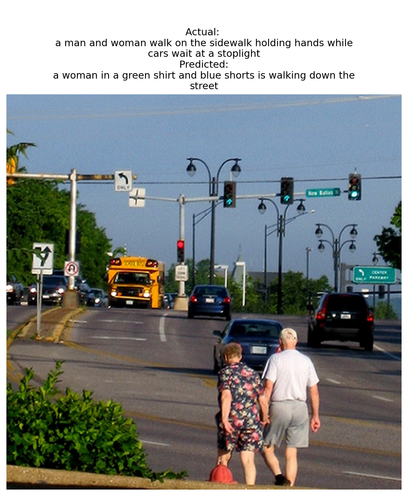
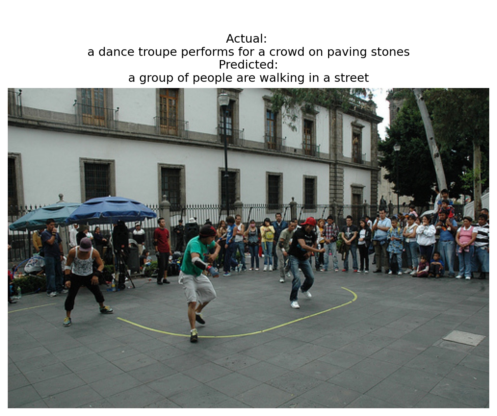
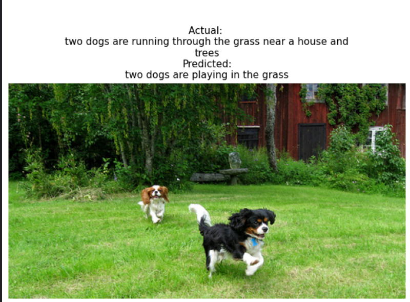

# Image Captioning using Vision Transformer and Transformer Decoder

This repository implements an **Image Captioning system** using a **Vision Transformer (ViT)** as an image encoder and a **custom Transformer decoder** for caption generation.  
The model generates natural language descriptions for images in an autoregressive manner.

---

## Model Overview

- **Image Encoder**  
  - Vision Transformer (ViT-B/16) from TensorFlow Hub  
  - Extracts a fixed-length image feature vector (768-dim)

- **Caption Decoder**  
  - Custom Transformer decoder implemented from scratch  
  - Masked self-attention (causal)  
  - Cross-attention over image features  
  - Positional embeddings  
  - Feed-forward layers  

The encoder is frozen, while the decoder is trained end-to-end.

---

## Dataset

- **Flickr30k**
- ~30,000 images
- 5 captions per image

## Evaluation
- Model has loss : .9042 and val_loss : 0.9877
- The model is evaluated on the test split using **BLEU scores**.

## Results

