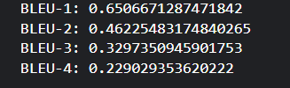
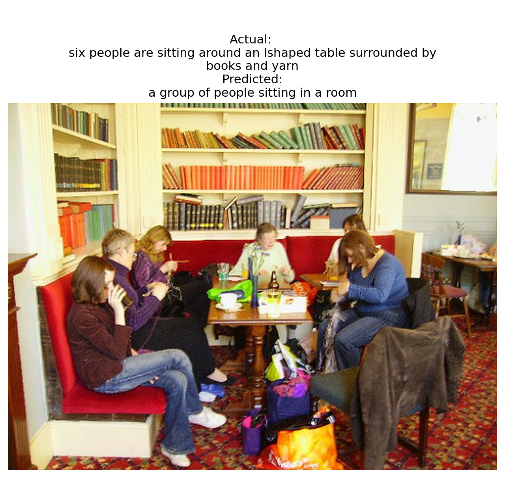
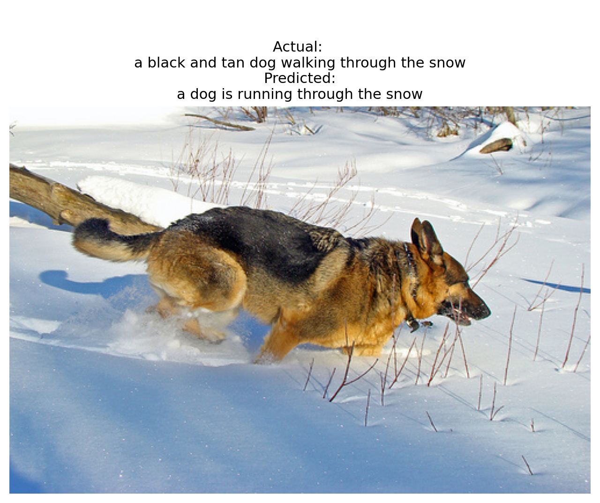
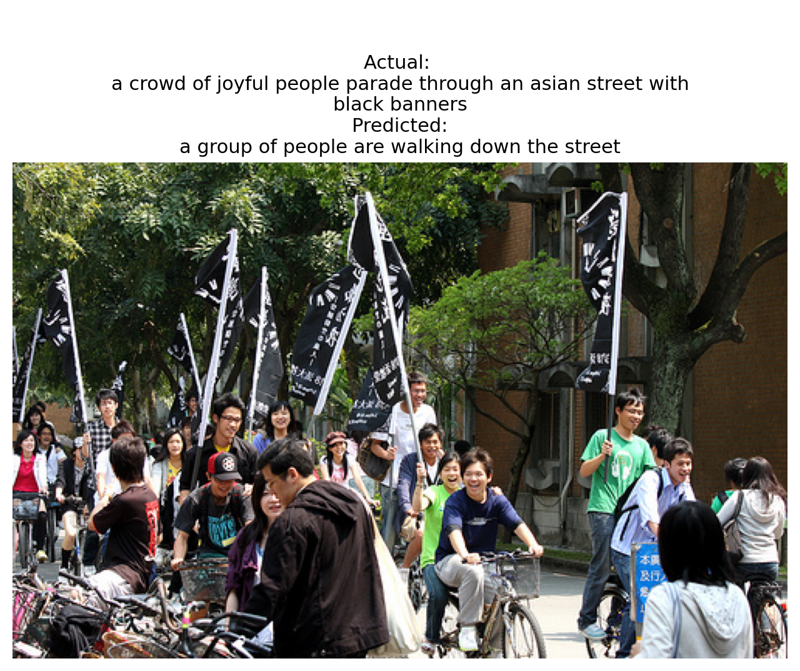
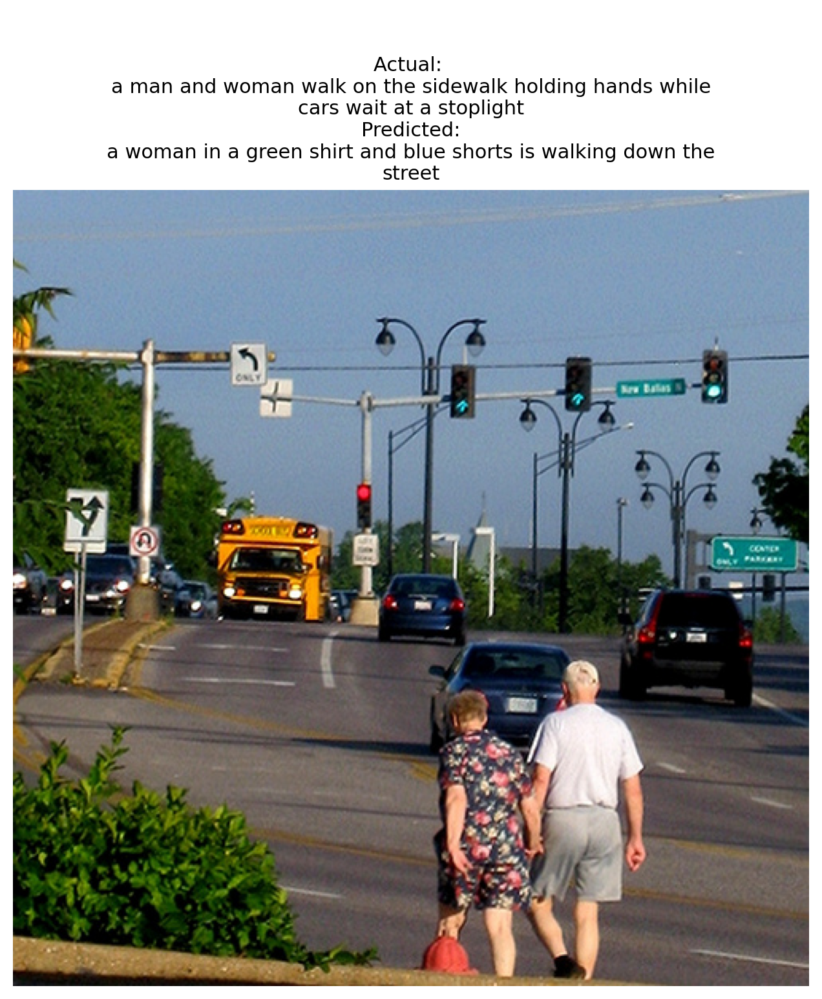
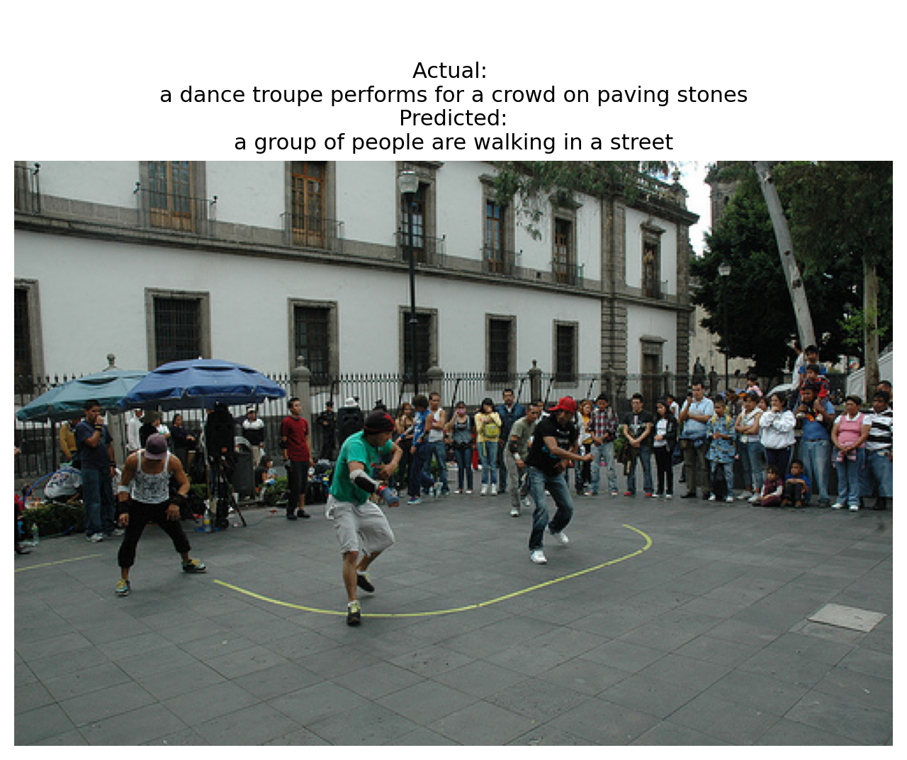
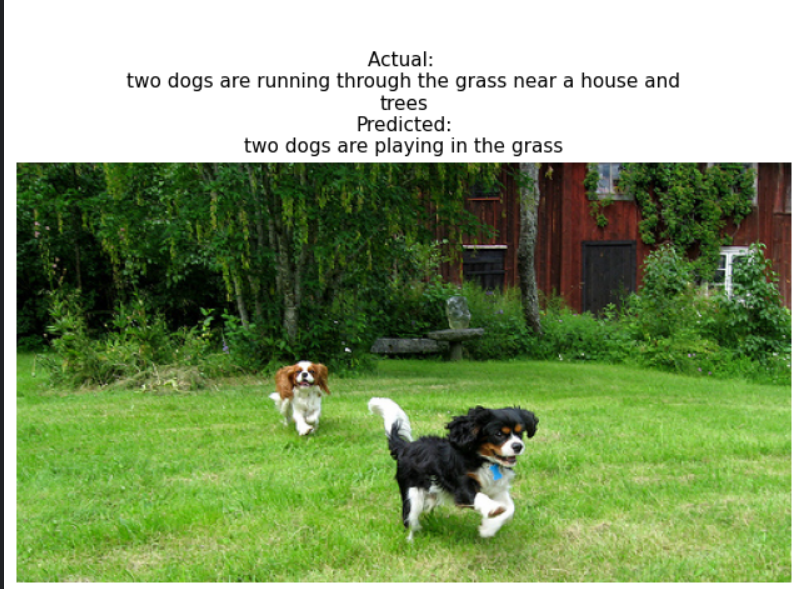

# Image Captioning using Vision Transformer and Transformer Decoder

This project is an **image captioning system** that generates a natural-language caption for an uploaded image. It uses a **Vision Transformer (ViT)** as the image encoder and a **custom Transformer decoder** for text generation.

The application is packaged as a **FastAPI web app**, containerized with **Docker**, and deployed on **EC2** using **Docker Hub** and **GitHub Actions**.

---

## What It Uses

- **Python 3.11**
- **FastAPI** for the web application
- **Uvicorn** as the ASGI server
- **TensorFlow / Keras** for model loading and inference
- **TensorFlow Hub** for the ViT encoder
- **Jinja2** templates for the HTML interface
- **Docker** for containerization
- **Docker Hub** for hosting the image
- **GitHub Actions** for CI/CD automation
- **AWS EC2** for deployment

---

## Model Overview

- **Image Encoder**
  - Vision Transformer (ViT-B/16) from TensorFlow Hub
  - Converts the input image into a fixed-size feature vector

- **Caption Decoder**
  - Custom Transformer decoder
  - Masked self-attention
  - Cross-attention over image features
  - Positional embeddings
  - Feed-forward layers

The encoder is frozen and the decoder is used to generate captions token by token.

---

## Deployment Flow

Current deployment is based on the following flow:

1. Push code to GitHub.
2. GitHub Actions runs the workflow.
3. The workflow pulls the prebuilt image from **Docker Hub**.
4. GitHub Actions SSHes into the **EC2 instance**.
5. EC2 pulls the Docker image from Docker Hub.
6. EC2 starts the container and serves the app on port `80`.

### Current Runtime Stack

- **EC2 instance** runs Ubuntu Linux
- **Docker container** exposes app port `8000`
- **EC2 host port 80** forwards to container port `8000`
- The app is accessed through the EC2 public IP or a domain name later

---

## Application Features

- Upload an image from the browser
- Generate an image caption using the trained model
- Show the uploaded image and predicted caption on the web page

---

## Important Files

- `app/main.py` - FastAPI app and prediction logic
- `app/templates/index.html` - Upload form and results page
- `src/models/feature_engineering.py` - ViT feature extraction helper
- `src/layers/Custom_layer_model.py` - Custom decoder layers
- `Dockerfile` - Container build file
- `.github/workflows/ci.yml` - CI/CD workflow

---

## How to Run Locally

### 1. Install dependencies

```bash
pip install -r Requirements.txt
```

### 2. Start the app

```bash
uvicorn app.main:app --reload
```

### 3. Open in browser

```text
http://127.0.0.1:8000
```

---

## Docker

### Build the image

```bash
docker build -t image_cap .
```

### Run the container

```bash
docker run -d -p 8000:8000 --name image-cap-app image_cap
```

Then open:

```text
http://localhost:8000
```

---

## Docker Hub Deployment

The image can be pushed to Docker Hub and then pulled on EC2 during deployment.

Example image name:

```text
ankursingh01/image_cap:latest
```

If the image is public, EC2 can pull it without Docker Hub credentials.

---

## GitHub Actions / EC2 Deployment

The workflow uses these GitHub Secrets:

- `EC2_HOST`
- `EC2_USER`
- `EC2_SSH_PRIVATE_KEY`
- `DOCKERHUB_IMAGE`

Optional, only if Docker Hub is private:

- `DOCKERHUB_USERNAME`
- `DOCKERHUB_TOKEN`

### EC2 Setup

Before deployment, the EC2 instance should have:

- Docker installed
- AWS CLI installed only if you use AWS-related commands
- An IAM role attached if needed for AWS access
- Port `80` open in the security group

### Example EC2 Access

- **Public IPv4**: `107.21.182.175`
- **Public DNS**: `ec2-107-21-182-175.compute-1.amazonaws.com`
- **EC2 user**: `ubuntu`

---

## Security Note

The app currently runs over HTTP on the EC2 public IP, so the browser may show **Not secure**.

To make it secure later, you can add:

- a domain name
- HTTPS using Nginx + Certbot
- an Elastic IP for stable IP mapping

---

## Dataset

- **Flickr30k**
- ~30,000 images
- 5 captions per image

---

## Evaluation

- Model loss: `0.9042`
- Validation loss: `0.9877`
- Test evaluation uses BLEU scores



---

## Results








